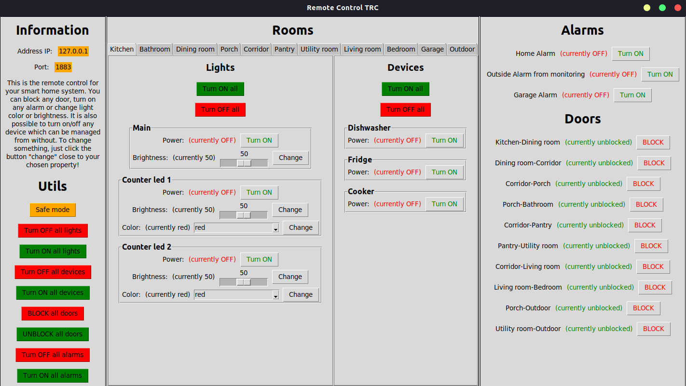

# Smart Home Remote Control
This is the application used as remote control to smart home. It allows you to connect to your home system and send commands, 
which can activate alarm or turn off the light in home. GUI in tkinter, communication between client and server is run by MQTT.
To start this app, you need to have python and mosquitto (MQTT) installed. After downloading all the package, enter "python main.py"
in console from main directory. It will show connection window where you need to enter server ip address and port. 
Then you will be able to see a bit bigger window where you can send specific commands to the server. More information in the documentation...

